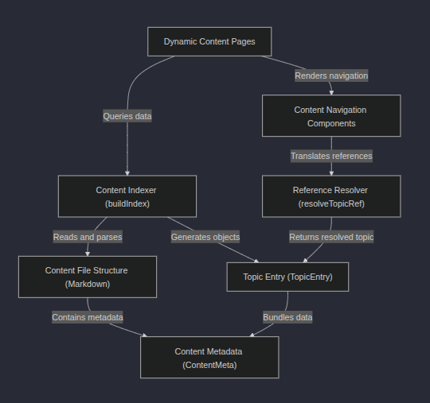

# IT Hub (Projeto em desenvolvimento!)
[]([https://github.com/ramironery/ramironery.com/blob/main/LICENSE) 

# Sobre o projeto

https://ramironery.com

Este projeto é uma plataforma centralizada para aulas e documentação de TI organizadas. Todo o conteúdo educacional é armazenado em arquivos Markdown estruturados (0) contendo dados essenciais de relacionamento definidos por Metadados de Conteúdo (1). Um poderoso Indexador de Conteúdo (2) lê e cataloga cada aula na inicialização, o que permite que o site crie páginas de conteúdo dinâmicas (5). Essa estrutura garante que os percursos de aprendizagem sejam coesos, pois os componentes de navegação (6) usam um Resolvedor de Referências (4) para vincular automaticamente as aulas (3) com base em seus relacionamentos internos.

## Visão geral visual

[]

## 


# Tecnologias utilizadas
## Back end
- NodeJS

# Front end
- HTML / CSS / JS / TypeScript
- ReactJS 
- React Native
- NextJS
## Implantação em produção
- Back end: 
- Front end web: 
- Banco de dados: 

# Como executar o projeto

Pré-requisitos: Node >=20

```bash
# clonar repositório
git clone git@github.com:ramironery/ramironery.com.git
# entrar na pasta do projeto back end
cd backend

# executar o projeto
Primeiro, iniciar o servidor de desenvolvimento :

```bash
npm run dev
# or
yarn dev
# or
pnpm dev
# or
bun dev
```
Abra o link [http://localhost:3000](http://localhost:3000) no seu navegador para ver o resultado.

# Autor

Ramiro Nery de Souza

https://www.linkedin.com/in/ramironery


